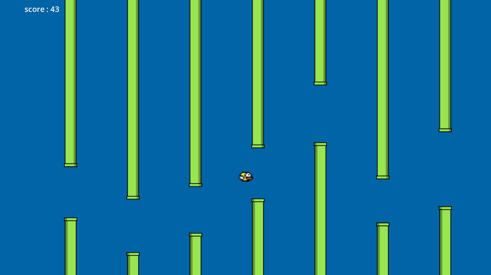
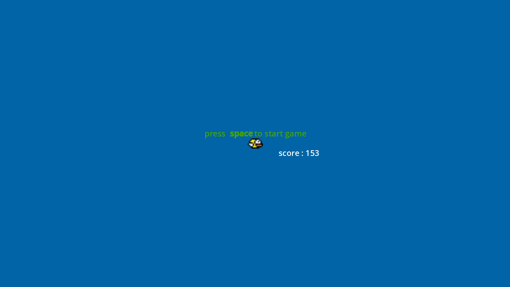

# a flappy berd

  - a experiment with godot to recreate a game "jumping berd trying to go between obstacles make score"
  - not so unique
  - try to learn about godot and gdscript
  - Godot version is [Godot Engine v4.4.beta2.official.a013481b0](https://godotengine.org)

# screenshot

 - 
 - 
